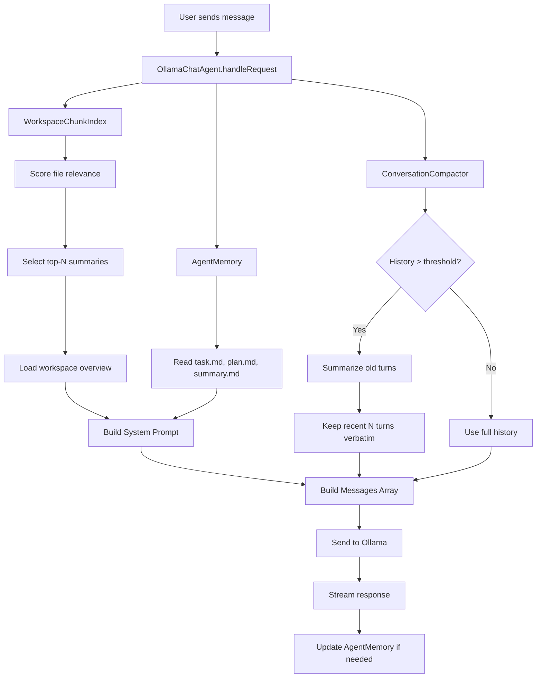

# Smart Context Chunking, Persistent Memory, and Conversation Compaction for Dark Matter IDE

## Background

Currently, Dark Matter's Ollama agent dumps **all source files** (up to 1.5MB) into the system prompt on every request. This approach:
- Blows up VRAM on large projects (even with the `maxContextWindow` setting)
- Wastes tokens on irrelevant files the user isn't asking about
- Loses conversation context once the history grows beyond the context window

A previous attempt at a "Project Digest" system (commit `e3f4bad`) was reverted because it was tightly coupled and used a single monolithic summarization pass. This plan takes a more robust, modular approach.

## Goals

1. **Chunked workspace indexing** — Break the workspace into small, per-file summaries stored on disk so only *relevant* chunks are loaded into context
2. **Persistent agent memory** — Save task lists, implementation plans, summaries, and activity logs to a `.darkmatter/` folder in the workspace so the agent can pick up where it left off across sessions
3. **Conversation compaction** — When conversation history grows large, automatically summarize older turns into a compact recap so the model doesn't lose track

---

## User Review Required

> [!NOTE]
> **Storage location**: `.darkmatter/` will be **committed to source control**. This allows users to clone the repo on any machine and load previous conversations, task state, and workspace index. Users who don't want this can add it to their own `.gitignore`.

> [!NOTE]
> **Progress notifications**: Indexing will show a **progress notification** (using `ProgressLocation.Notification`) so the user knows what's happening during the initial scan and re-indexing.

## Resolved Decisions

1. **Token budget**: The workspace context budget percentage is **user-configurable** via `ollamaAgent.smartContext.workspaceBudgetPercent` (default 30%, range 10-60%). This gives users full control over the tradeoff between workspace context and conversation/response budget.

2. **Re-indexing trigger**: **Configurable** via `ollamaAgent.smartContext.reindexStrategy` — users can choose `"fileWatcher"` (re-index when files change) or `"interval"` (timed re-scan, with configurable interval). Default: `"fileWatcher"`.

---

## Proposed Changes

### Component 1: Workspace Chunk Index (`workspaceChunkIndex.ts`)

A new service that replaces the monolithic workspace scan with a per-file summary index.

#### [NEW] [workspaceChunkIndex.ts](file:///home/abdallah/.gemini/antigravity/scratch/dark-matter-ide/src/vs/workbench/contrib/chat/browser/ollama/workspaceChunkIndex.ts)

**Purpose**: Manages a persistent index of per-file summaries stored in `.darkmatter/index/`.

**Key design**:
- Each source file gets a separate summary file: `.darkmatter/index/<hash>.json` containing `{ path, lastModified, summary, keyExports, dependencies }`
- On workspace scan, only files that have changed since last index are re-summarized (delta indexing)
- Summaries are generated by sending each file to the Ollama model with a concise "summarize this file" prompt
- A **relevance scorer** selects which file summaries to include in context based on:
  - Files currently open in the editor
  - Files mentioned in the user's message (path matching)
  - Files that import/depend on the currently active file
  - Recently modified files
- A **workspace overview** summary is generated from all per-file summaries combined and cached at `.darkmatter/workspace_overview.md`

**Token budget**: Instead of dumping 1.5MB of raw source, we'll inject:
- The workspace overview (~2-4k tokens)
- Relevant file summaries (~1-2k tokens each, max 10-15 files)
- Full content of the currently active file only
- Total workspace context budget: configurable, default ~30% of `maxContextWindow`

---

### Component 2: Persistent Agent Memory (`agentMemory.ts`)

#### [NEW] [agentMemory.ts](file:///home/abdallah/.gemini/antigravity/scratch/dark-matter-ide/src/vs/workbench/contrib/chat/browser/ollama/agentMemory.ts)

**Purpose**: Reads/writes persistent task state and session summaries to `.darkmatter/` so the agent has continuity across IDE restarts.

**Files managed**:
| File | Purpose |
|------|---------|
| `.darkmatter/task.md` | Current task checklist (TODO/in-progress/done) |
| `.darkmatter/plan.md` | Current implementation plan |
| `.darkmatter/summary.md` | Running summary of what's been accomplished |
| `.darkmatter/activity.log` | Timestamped log of agent actions |

**How it works**:
- At the start of each chat request, the agent reads these files and includes them in the system prompt as "persistent memory"
- The agent is instructed (via system prompt) to update these files when it starts/completes tasks
- The system prompt will include instructions like: *"When starting a new task, update `.darkmatter/task.md`. When completing work, update `.darkmatter/summary.md`."*
- On first use, the files are created with templates

---

### Component 3: Conversation Compaction (`conversationCompactor.ts`)

#### [NEW] [conversationCompactor.ts](file:///home/abdallah/.gemini/antigravity/scratch/dark-matter-ide/src/vs/workbench/contrib/chat/browser/ollama/conversationCompactor.ts)

**Purpose**: Automatically compresses conversation history when it exceeds a token threshold.

**Algorithm**:
1. Before building messages, estimate total token count of conversation history (using the existing `chars / 4` heuristic)
2. If total history exceeds **60% of `maxContextWindow`** minus the workspace context budget:
   - Keep the **last N turns** (configurable, default 6) verbatim — these are "recent memory"
   - Summarize all older turns into a single "conversation recap" message using the Ollama model
   - Cache the recap so we don't re-summarize on every request
   - The recap is injected as the first message after the system prompt
3. As conversation continues growing, the recap is incrementally updated (append new compacted turns to existing recap)

**Format of compacted history**:
```
[Conversation Recap - Turns 1-15]
- User asked about authentication flow. Agent explained JWT token handling in auth.ts.
- User requested refactoring of the database layer. Agent updated db/connection.ts and db/queries.ts.
- User reported a bug in the pagination logic. Agent identified off-by-one error in paginator.ts line 42.
...
```

---

### Component 4: Modified Ollama Chat Agent

#### [MODIFY] [ollamaChatAgent.ts](file:///home/abdallah/.gemini/antigravity/scratch/dark-matter-ide/src/vs/workbench/contrib/chat/browser/ollama/ollamaChatAgent.ts)

**Changes**:
1. **Replace monolithic `scanWorkspace()` / `_cachedSourceFiles`** with calls to the new `WorkspaceChunkIndex` for smart context selection
2. **Inject persistent memory** from `AgentMemory` into the system prompt
3. **Replace raw history loop** (lines 424-437) with `ConversationCompactor` to manage history size
4. **Update `buildSystemPrompt()`** to use a token-budgeted approach:
   - Workspace overview (from chunk index)
   - Persistent memory (task/plan/summary)
   - Relevant file summaries (from chunk index, scored by relevance)
   - Active editor content (full file, as today)
5. Keep the directory tree but make it optional/configurable (it can be large on big projects)

---

### Component 5: Configuration Updates

#### [MODIFY] [ollamaConfiguration.ts](file:///home/abdallah/.gemini/antigravity/scratch/dark-matter-ide/src/vs/workbench/contrib/chat/browser/ollama/ollamaConfiguration.ts)

**New settings**:
| Setting | Type | Default | Description |
|---------|------|---------|-------------|
| `ollamaAgent.smartContext.enabled` | boolean | `true` | Enable smart chunked context instead of dumping all files |
| `ollamaAgent.smartContext.maxRelevantFiles` | number | `15` | Max number of relevant file summaries to include |
| `ollamaAgent.smartContext.workspaceBudgetPercent` | number | `30` | Percentage of context window reserved for workspace context (range: 10-60%) |
| `ollamaAgent.smartContext.reindexStrategy` | string | `"fileWatcher"` | How to trigger re-indexing: `"fileWatcher"` (on file change) or `"interval"` (timed re-scan) |
| `ollamaAgent.smartContext.reindexIntervalSeconds` | number | `120` | Re-scan interval in seconds (only used when strategy is `"interval"`) |
| `ollamaAgent.conversationCompaction.enabled` | boolean | `true` | Enable automatic conversation history compaction |
| `ollamaAgent.conversationCompaction.recentTurns` | number | `6` | Number of recent turns to keep verbatim |
| `ollamaAgent.persistentMemory.enabled` | boolean | `true` | Enable persistent task/plan/summary files |

#### [MODIFY] [ollamaStatusBar.ts](file:///home/abdallah/.gemini/antigravity/scratch/dark-matter-ide/src/vs/workbench/contrib/chat/browser/ollama/ollamaStatusBar.ts)

- Add a "Rebuild Workspace Index" option to the quick-pick menu
- Add a "Smart Context" toggle option

---

## Architecture Diagram



## Token Budget Breakdown (example: 128k context window)

| Component | Budget | ~Tokens |
|-----------|--------|---------|
| System prompt (instructions) | 2% | ~2,500 |
| Workspace overview | 3% | ~3,800 |
| Persistent memory (task/plan/summary) | 5% | ~6,400 |
| Relevant file summaries (10-15 files) | 20% | ~25,600 |
| Active editor file (full) | 5% | ~6,400 |
| Conversation recap (compacted) | 10% | ~12,800 |
| Recent conversation turns (verbatim) | 25% | ~32,000 |
| **Response budget** | **30%** | **~38,400** |

---

## Verification Plan

### Automated Tests
- Unit test `WorkspaceChunkIndex`: verify delta indexing only processes changed files
- Unit test `ConversationCompactor`: verify compaction triggers at threshold and preserves recent turns
- Unit test token budget calculation: verify components stay within allocated budgets
- Build verification: `npm run compile` to ensure TypeScript compiles cleanly

### Manual Verification
- Open Dark Matter on a large project (>100 files), verify that:
  - `.darkmatter/index/` is created with per-file summaries
  - `.darkmatter/workspace_overview.md` is generated
  - System prompt size is dramatically smaller than before
  - Relevant files are correctly scored (open file + mentioned files appear)
- Have a long conversation (20+ turns), verify:
  - Older turns get compacted into a recap
  - Model still remembers key facts from early conversation
  - VRAM usage stays stable
- Restart IDE, verify persistent memory files are loaded and agent has continuity
